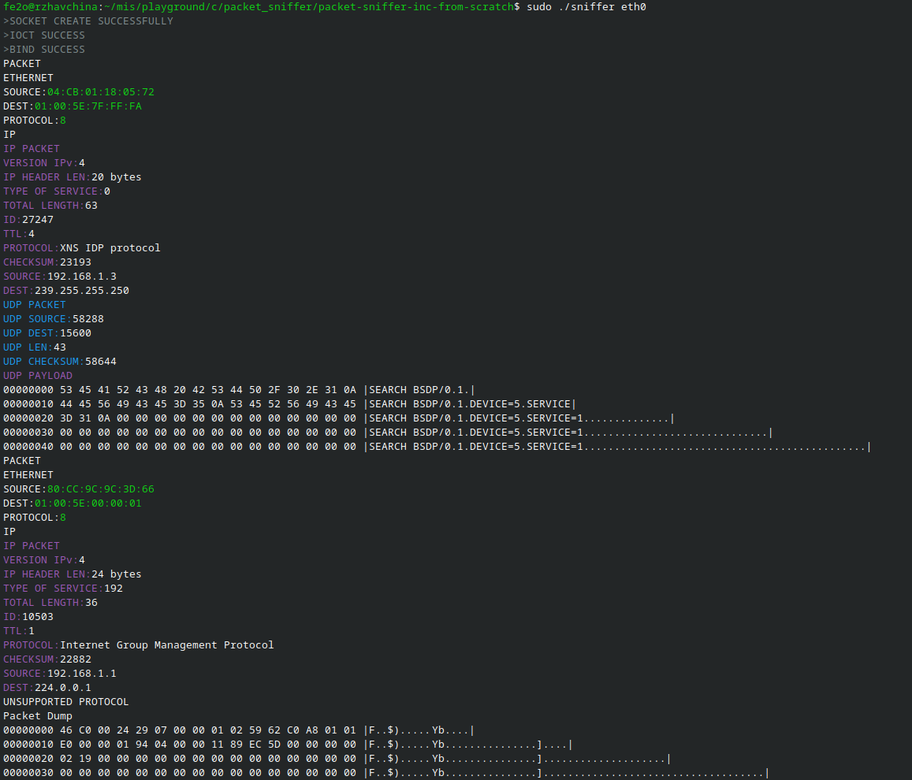

# packet sniffer in c from scratch
packet sniffer in c from scratchj without any third party dependency

Example use case  

# Notice
only support linux user

when using the applicatiuon you need to use sudo because of security reason

# How to use

<ol>
  <li>run make or compile.sh file</li>
  <li>./sniffer (network interface)</li>
</ol> 

example (network interface) arguments:  

lo  
eth0

